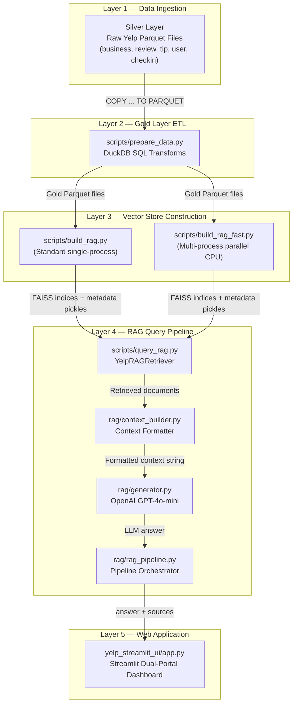

# ⭐ Yelp RAG System — Complete Project Flow & Architecture Documentation

> **Repository**: [neuroEngage/rag-send](https://github.com/neuroEngage/rag-send)
> **Stack**: Python 3.14 · DuckDB · FAISS · SentenceTransformers · OpenAI GPT-4o-mini · Streamlit

---

## Table of Contents

1. [High-Level Architecture](#1-high-level-architecture)
2. [Data Pipeline (Silver → Gold)](#2-data-pipeline-silver--gold)
3. [Embedding & Vector Store Construction](#3-embedding--vector-store-construction)
4. [RAG Pipeline (Retriever → Context → Generator)](#4-rag-pipeline-retriever--context--generator)
5. [Streamlit Dual-Portal UI](#5-streamlit-dual-portal-ui)
6. [File-by-File Breakdown](#6-file-by-file-breakdown)
7. [Configuration & Environment](#7-configuration--environment)
8. [End-to-End Execution Flow](#8-end-to-end-execution-flow)

---

## 1. High-Level Architecture

The project is a **Retrieval-Augmented Generation (RAG)** system built on the public Yelp dataset. It has four distinct layers that execute sequentially:



### What Each Layer Does

| Layer | Purpose | Key Technology |
|:------|:--------|:---------------|
| **Silver Layer** | Raw Yelp data stored as Spark-produced Parquet partitions | Apache Spark, Parquet |
| **Gold Layer ETL** | Transforms raw data into RAG-ready documents with `document_text` fields | DuckDB SQL |
| **Vector Store** | Encodes documents into 384-dimensional dense vectors and indexes them in FAISS | SentenceTransformers, FAISS |
| **RAG Pipeline** | Retrieves → formats → generates factual LLM answers | FAISS, OpenAI API |
| **Web Dashboard** | Two-portal Streamlit UI for consumers and business owners | Streamlit |

---

## 2. Data Pipeline (Silver → Gold)

### 2.1 Silver Layer (Raw Input)

The Silver Layer contains Spark-partitioned Parquet files ingested from the original Yelp JSON dataset. These live in `data/01_silver/`:

```
data/01_silver/
├── business/        # 4 Parquet partition files — 150,346 businesses
├── review/          # 4 Parquet partition files — 6,990,280 reviews
├── checkin/         # 1 Parquet file
├── tip/             # 1 Parquet file
└── user/            # 1 Parquet file
```

> [!NOTE]
> The Silver Layer files were pre-generated by a Spark ETL pipeline (not part of this repo's runtime). They serve as the immutable source-of-truth input.

### 2.2 Gold Layer ETL — [prepare_data.py](file:///c:/Users/shank/Downloads/yelp_project/scripts/prepare_data.py)

This script transforms Silver → Gold using **DuckDB's `COPY ... TO PARQUET` streaming operator**, which avoids loading the entire 7M-row review dataset into RAM.

#### Business Document Generation

The script reads every row from `01_silver/business/*.parquet` and constructs a unified `document_text` field by concatenating:

```
Business Name: {name}
Primary Category: {first category}
Categories: {all categories}
Location: {address}, {city}, {state} {postal_code}
Coordinates: Lat {lat}, Lon {lon}
Rating: {stars} stars ({review_count} reviews)
Price Range: {price_range}
Operating Status: {Open/Closed}
Hours: {all hours}
Features: {creditcards, parking, delivery, takeout, wifi, ...}
```

Each output row also preserves structured metadata columns (`business_id`, `business_name`, `city`, `state`, `primary_category`, `business_rating`, `review_count`, `price_range`, `is_open`, etc.) alongside the flat-text `document_text`.

**Output**: `data/02_gold/business_documents/business_documents.parquet` — **150,346 rows**

#### Review Document Generation

The script JOINs `01_silver/review/*.parquet` with `01_silver/business/*.parquet` to enrich each review with the business name, city, state, and primary category. It then constructs:

```
Review for {business_name} ({city}, {state})
Category: {primary_category}
Review Rating: {stars} stars
Date: {review_date}
Sentiment: {positive|neutral|negative}
Content: {full review text}
```

Sentiment is derived from star ratings:
- **≥ 4 stars** → `positive`
- **= 3 stars** → `neutral`
- **≤ 2 stars** → `negative`

**Output**: `data/02_gold/review_documents/review_documents.parquet` — **6,990,280 rows**

#### Technical Details

| Setting | Value | Why |
|:--------|:------|:----|
| `PRAGMA preserve_insertion_order=false` | DuckDB optimization | Allows parallel partition scanning |
| `PRAGMA threads=4` | 4 DuckDB worker threads | Balanced CPU utilization |
| `COPY ... TO ... (FORMAT PARQUET)` | Streaming write | Prevents 7M-row DataFrame from loading into RAM |

---

## 3. Embedding & Vector Store Construction

### 3.1 Embedding Model

The project uses **[`sentence-transformers/all-MiniLM-L6-v2`](https://huggingface.co/sentence-transformers/all-MiniLM-L6-v2)**:

| Property | Value |
|:---------|:------|
| Architecture | MiniLM (6-layer distilled BERT) |
| Embedding Dimension | **384** |
| Max Sequence Length | 256 tokens |
| Normalization | L2-normalized (unit vectors) |
| Similarity Metric | Cosine similarity (via inner product on unit vectors) |

### 3.2 Standard Builder — [build_rag.py](file:///c:/Users/shank/Downloads/yelp_project/scripts/build_rag.py)

This is the simpler, single-process builder. Flow:

```
1. Load SentenceTransformer model
2. Read Gold Parquet via DuckDB (up to max_records rows)
3. Extract document_text column → list of strings
4. Batch-encode texts (batch_size=256) with normalize_embeddings=True
5. Stack all embeddings into a single float32 NumPy matrix
6. Create FAISS IndexFlatIP(384) and add the matrix
7. Write FAISS index to .faiss file
8. Pickle the metadata list (one dict per vector) to .pkl file
```

The metadata list is critical — each entry is a full dict of the original Parquet row (document_id, business_name, city, state, stars, sentiment, document_text, etc.). FAISS only stores vectors, so metadata is kept in a parallel pickle file indexed by the same integer position.

**Usage**:
```powershell
python scripts/build_rag.py 50000   # Process up to 50K records per dataset
```

### 3.3 High-Performance Builder — [build_rag_fast.py](file:///c:/Users/shank/Downloads/yelp_project/scripts/build_rag_fast.py)

This is the production builder designed to process the full 7.14M documents on CPU in ~1.5-2 hours. It uses four key optimizations:

#### Optimization 1: Multi-Process Parallelism

```python
num_workers = min(mp.cpu_count(), 4)  # Up to 4 parallel processes
records_per_worker = ceil(total_records / num_workers)
```

Each worker process:
1. Opens its own DuckDB connection
2. Reads its partition via `LIMIT {chunk_size} OFFSET {offset}`
3. Loads its own copy of the SentenceTransformer model (`local_files_only=True`)
4. Encodes its partition independently
5. Builds a local FAISS sub-index
6. Saves its sub-index + metadata to temp files

#### Optimization 2: Per-Worker Thread Limiting

```python
torch.set_num_threads(2)
os.environ["OMP_NUM_THREADS"] = "2"
os.environ["MKL_NUM_THREADS"] = "2"
```

This prevents CPU over-subscription when 4 workers each try to use all cores.

#### Optimization 3: Offline Model Loading

```python
os.environ["HF_HUB_OFFLINE"] = "1"
os.environ["TRANSFORMERS_OFFLINE"] = "1"
model = SentenceTransformer(config.EMBEDDING_MODEL_NAME, local_files_only=True)
```

Workers load the model from local cache, avoiding redundant network calls.

#### Optimization 4: Zero-Copy FAISS Merge

```python
master_index = faiss.IndexFlatIP(384)
for w_id in range(num_workers):
    sub_idx = faiss.read_index(str(temp_dir / f"part_{w_id}.faiss"))
    master_index.merge_from(sub_idx)  # C++ pointer-level merge
```

Sub-indices are merged without copying vector data — FAISS does this at the C++ memory level.

#### Output Files

| File | Description | Approx Size |
|:-----|:------------|:------------|
| `models/faiss_index/business_index.faiss` | 150,346 × 384-dim float32 vectors | ~220 MB |
| `models/faiss_index/business_meta.pkl` | Metadata dicts for all business vectors | ~150 MB |
| `models/faiss_index/review_index.faiss` | Up to 6.99M × 384-dim float32 vectors | ~10 GB |
| `models/faiss_index/review_meta.pkl` | Metadata dicts for all review vectors | ~8 GB |

---

## 4. RAG Pipeline (Retriever → Context → Generator)

The RAG pipeline is a clean 3-stage architecture with strict separation of concerns:

```
┌─────────────────────────────────────────────────────────────────────┐
│                    answer_question() — rag_pipeline.py              │
│                                                                     │
│   ┌──────────────┐    ┌──────────────────┐    ┌──────────────────┐ │
│   │  1. RETRIEVE  │───▶│  2. BUILD CONTEXT │───▶│  3. GENERATE    │ │
│   │  query_rag.py │    │ context_builder.py│    │  generator.py   │ │
│   │              │    │                  │    │                  │ │
│   │ FAISS search │    │ Format retrieved │    │ OpenAI API call │ │
│   │ + metadata   │    │ docs into text   │    │ with strict     │ │
│   │   filtering  │    │ blocks for LLM   │    │ system prompt   │ │
│   └──────────────┘    └──────────────────┘    └──────────────────┘ │
│                                                                     │
│   Returns: { "answer": str, "sources": list, "context": str }     │
└─────────────────────────────────────────────────────────────────────┘
```

### 4.1 Stage 1: Retriever — [query_rag.py](file:///c:/Users/shank/Downloads/yelp_project/scripts/query_rag.py)

The `YelpRAGRetriever` class is the core search engine.

#### Initialization (`__init__`)

```python
self.model = SentenceTransformer("sentence-transformers/all-MiniLM-L6-v2")
self.biz_index = faiss.read_index("models/faiss_index/business_index.faiss")
self.biz_meta = pickle.load("models/faiss_index/business_meta.pkl")
self.rev_index = faiss.read_index("models/faiss_index/review_index.faiss")
self.rev_meta = pickle.load("models/faiss_index/review_meta.pkl")
```

On startup, it loads the SentenceTransformer model and all four FAISS/metadata files into memory.

#### Search Flow (`search()`)

```python
def search(self, query_text, doc_type="all", city=None, min_stars=None,
           sentiment=None, business_id=None, top_k=5):
```

**Step 1 — Query Encoding**:
```python
query_vec = self.model.encode([query_text], normalize_embeddings=True).astype(np.float32)
```
The user's natural language question is encoded into a 384-dimensional unit vector.

**Step 2 — FAISS Brute-Force Search**:
```python
# Over-fetch to allow for post-filtering
scores, indices = self.biz_index.search(query_vec, top_k * 3)   # Business: 3x over-fetch
scores, indices = self.rev_index.search(query_vec, top_k * 10)  # Review: 10x over-fetch
```
FAISS `IndexFlatIP` computes the **inner product** (= cosine similarity for unit vectors) between the query vector and every vector in the index. It returns the top-K highest-scoring vector IDs and their scores.

> [!IMPORTANT]
> The review index over-fetches by **10x** because post-filtering (city, stars, sentiment, business_id) can discard many results. This ensures enough pass the filters to fill `top_k`.

**Step 3 — Metadata Post-Filtering**:
```python
if business_id and meta.get("business_id") != business_id:
    continue  # Skip: wrong business
if city and meta.get("city", "").lower() != city.lower():
    continue  # Skip: wrong city
if min_stars and meta.get("stars", 0) < min_stars:
    continue  # Skip: too low rating
if sentiment and meta.get("sentiment", "").lower() != sentiment.lower():
    continue  # Skip: wrong sentiment
```

This is where **business scoping** happens. When the Business Owner Copilot queries for a specific business, `business_id` is passed through, and only reviews belonging to that business survive filtering.

**Step 4 — Sort & Return**:
```python
results = sorted(results, key=lambda x: x["score"], reverse=True)[:top_k]
```

Results from both indices are merged, sorted by cosine similarity score (descending), and truncated to `top_k`.

Each result is a dict with: `score`, `document_id`, `document_type`, `business_name`, `city`, `state`, `primary_category`, `stars`/`business_rating`, `sentiment`, `review_date`, `document_text`.

### 4.2 Stage 2: Context Builder — [context_builder.py](file:///c:/Users/shank/Downloads/yelp_project/rag/context_builder.py)

This module has a single function: `build_context(results)`. It takes the list of retrieved dicts and formats them into a clean text block for the LLM.

For **review** documents, it produces:
```
REVIEW 1
Business: Acme Oyster House
City: New Orleans, LA
Rating: 5/5
Sentiment: Positive
Date: 2024-03-15

Review:
Review for Acme Oyster House (New Orleans, LA)
Category: Seafood
...

────────────────────────────────────────────────────────────

REVIEW 2
Business: ...
```

For **business** documents:
```
BUSINESS PROFILE 1
Name: Commander's Palace
Category: Cajun/Creole
Location: New Orleans, LA
Rating: 4.5/5
Price Range: 4

Description:
Business Name: Commander's Palace
...
```

Multiple results are separated by a `─` line divider. If no results are found, it returns `"No relevant Yelp information was found for this query."`.

### 4.3 Stage 3: Generator — [generator.py](file:///c:/Users/shank/Downloads/yelp_project/rag/generator.py)

This module calls the OpenAI Chat Completions API with a **strict RAG system prompt** and the formatted context.

#### System Prompt

```
You are a Yelp Business Intelligence Assistant.

Answer the user's question using ONLY the provided Yelp information.

Rules:
1. Do not invent facts.
2. Do not use outside knowledge.
3. If the retrieved information is insufficient, explicitly say so.
4. Distinguish facts from recommendations.
5. Keep the answer concise and useful.
6. When making a claim about customer opinions, refer to the provided reviews.
7. Use bullet points or numbered lists where appropriate for clarity.
```

#### API Call

```python
client = OpenAI(api_key=os.getenv("OPENAI_API_KEY"))
response = client.chat.completions.create(
    model="gpt-4o-mini",
    messages=[
        {"role": "system", "content": SYSTEM_PROMPT},
        {"role": "user",   "content": f"USER QUESTION:\n{question}\n\nRETRIEVED YELP INFORMATION:\n{context}"},
    ],
    temperature=0.3,   # Low temperature → factual, less creative
    max_tokens=800,
)
```

| Parameter | Value | Reasoning |
|:----------|:------|:----------|
| `model` | `gpt-4o-mini` | Fast, cost-effective, good at factual extraction |
| `temperature` | `0.3` | Low randomness for factual consistency |
| `max_tokens` | `800` | Enough for a detailed but concise answer |

### 4.4 Pipeline Orchestrator — [rag_pipeline.py](file:///c:/Users/shank/Downloads/yelp_project/rag/rag_pipeline.py)

The `answer_question()` function is the **single unified entry point** for the entire RAG pipeline:

```python
def answer_question(question, doc_type="review", city=None, min_stars=None,
                    sentiment=None, business_id=None, top_k=5, llm_model="gpt-4o-mini"):
    
    retriever = _get_retriever()                                    # Lazy singleton
    results = retriever.search(question, doc_type, city, ...)       # Stage 1: Retrieve
    context = build_context(results)                                # Stage 2: Format
    answer = generate_answer(question, context, model=llm_model)    # Stage 3: Generate

    return {"answer": answer, "sources": results, "context": context}
```

The retriever is a **module-level singleton** (loaded once, reused across all calls in the Streamlit session):

```python
_retriever = None

def _get_retriever():
    global _retriever
    if _retriever is None:
        _retriever = YelpRAGRetriever()  # Loads model + FAISS indices
    return _retriever
```

---

## 5. Streamlit Dual-Portal UI

### 5.1 Application Entry Point — [app.py](file:///c:/Users/shank/Downloads/yelp_project/app.py)

The root `app.py` is a thin redirect that delegates to the real UI module:

```python
UI_APP_PATH = Path(__file__).resolve().parent / "yelp_streamlit_ui" / "app.py"
with open(UI_APP_PATH, "r", encoding="utf-8") as f:
    code = compile(f.read(), str(UI_APP_PATH), "exec")
    exec(code, {"__name__": "__main__", "__file__": str(UI_APP_PATH)})
```

This exists so `streamlit run app.py` works from the project root while the actual UI code lives in its own directory.

### 5.2 Main UI — [yelp_streamlit_ui/app.py](file:///c:/Users/shank/Downloads/yelp_project/yelp_streamlit_ui/app.py)

**793 lines** implementing the complete dual-portal web application.

#### Design System: Yelp "Cookbook" Theme

The UI uses custom CSS implementing Yelp's official design language:

| Token | Value | Usage |
|:------|:------|:------|
| `--yelp-red` | `#FA4848` | Primary brand color, star ratings |
| `--yelp-teal` | `#0396BC` | Business intelligence accent |
| `--yelp-green` | `#029E6A` | Positive sentiment indicators |
| `--yelp-red-dark` | `#D71616` | Negative sentiment, complaints |
| Typography | Poppins (headings) + Open Sans (body) | Google Fonts |

#### Cached Resources

```python
@st.cache_resource
def get_duckdb_con():
    return duckdb.connect()        # Single DuckDB connection for all SQL queries

@st.cache_resource
def load_retriever():
    return YelpRAGRetriever()      # FAISS + SentenceTransformer (loaded once)
```

Both are cached at the Streamlit resource level — they persist across reruns and user interactions.

#### Portal 1: 👤 Consumer Search & Discovery

```
┌──────────────────────────────────────────────────────────────┐
│  SIDEBAR                    │  MAIN AREA                     │
│  ─────────                  │  ──────────                    │
│  City Filter (text input)   │  Chat Message History           │
│  Min Stars (1.0-5.0 slider) │  ┌─────────────────────────┐   │
│  Results per Query (1-10)   │  │ User: "Best pizza in     │   │
│  🧹 Clear Chat History     │  │        Philly"           │   │
│                             │  ├─────────────────────────┤   │
│                             │  │ 🤖 AI Business Insight  │   │
│                             │  │  (gradient red banner)   │   │
│                             │  │                         │   │
│                             │  │ [AI-generated answer]   │   │
│                             │  │                         │   │
│                             │  │ 📄 Evidence Cards       │   │
│                             │  │  #1 Biz (City, ST)      │   │
│                             │  │  ★★★★★ 4.5 | Pizza     │   │
│                             │  │  sim=0.847              │   │
│                             │  │  "Review excerpt..."    │   │
│                             │  │                         │   │
│                             │  │  #2 Biz (City, ST)      │   │
│                             │  │  ★★★★☆ 4.0 | Italian   │   │
│                             │  │  sim=0.812              │   │
│                             │  └─────────────────────────┘   │
│                             │  Chat Input Box                 │
└──────────────────────────────────────────────────────────────┘
```

**How it works**:

1. User types a question in the chat input
2. If there are previous messages, the last 2 user messages are concatenated to form a richer search query (multi-turn context)
3. Calls `answer_question(question, doc_type="all", city=..., min_stars=..., top_k=...)`
4. Displays the AI-generated answer in a gradient red banner
5. Shows evidence source cards with: business name, location, star rating, category, sentiment, cosine similarity score, and document text excerpt
6. All messages are stored in `st.session_state.customer_messages` for multi-turn conversation

#### Portal 2: 💼 Business Owner Intelligence Dashboard

```
┌──────────────────────────────────────────────────────────────────────┐
│  SIDEBAR                       │  MAIN AREA                         │
│  ─────────                     │  ──────────                        │
│  🔎 Search Business (text)    │  ┌─ HERO SECTION ─────────────────┐│
│  📍 Select Location (dropdown)│  │ Acme Oyster House               ││
│                                │  │ ★★★★☆ 4.23 (1,247 reviews)    ││
│                                │  │ $$ | Seafood | Open Now         ││
│                                │  │ 📍 724 Iberville St, NO, LA    ││
│                                │  └────────────────────────────────┘│
│                                │                                    │
│                                │  ┌─ KPI CARDS (4-column grid) ───┐│
│                                │  │ 4.23★  │ 1,247  │ 72.3% │ 8.1%││
│                                │  │ Avg    │ Total  │ Pos   │ Neg ││
│                                │  └────────────────────────────────┘│
│                                │                                    │
│                                │  ┌── 65% Column ──┐┌─ 35% Column─┐│
│                                │  │ Tab: Sentiment  ││ 🤖 AI Copilot│
│                                │  │ Tab: Archive    ││              │
│                                │  │                 ││ Chat messages│
│                                │  │ 🌟 Positive     ││              │
│                                │  │ Reviews (FIRST) ││ Chat input   │
│                                │  │                 ││              │
│                                │  │ 🚨 Negative     ││              │
│                                │  │ Complaints      ││              │
│                                │  │ (SECOND)        ││              │
│                                │  └─────────────────┘└─────────────┘│
└──────────────────────────────────────────────────────────────────────┘
```

**Business Selection Flow**:

1. User types in the search box (name, city, or category)
2. DuckDB queries Gold business Parquet for matching rows (`ILIKE` fuzzy match), ordered by review_count DESC, limited to 300
3. User picks a specific business from the dropdown
4. The `business_id` is captured for all subsequent queries

**KPI Calculation** (via DuckDB aggregate SQL):

```sql
SELECT 
    COUNT(*) as total_reviews,
    AVG(stars) as avg_stars,
    COUNT(CASE WHEN sentiment = 'positive' THEN 1 END) as pos_cnt,
    COUNT(CASE WHEN sentiment = 'neutral' THEN 1 END) as neu_cnt,
    COUNT(CASE WHEN sentiment = 'negative' THEN 1 END) as neg_cnt
FROM read_parquet('{gold_review_glob}')
WHERE business_id = ?
```

**AI Owner Copilot** — the right column chatbot:

```python
rag_output = answer_question(
    question=owner_prompt,
    doc_type="review",          # Only search review index
    business_id=selected_biz_id, # ← CRITICAL: scope to this business only
    top_k=6,
)
```

> [!IMPORTANT]
> The `business_id` filter is the key architectural decision that prevents **cross-business FAISS bleed**. Without it, asking "What are the complaints?" would return reviews from unrelated businesses that happen to discuss complaints. With it, the FAISS over-fetches 60 candidates (top_k × 10) and only keeps the 6 that belong to the selected business.

**Sentiment Review Tabs**:

- **Positive Praise Reviews** (green left-border cards, shown FIRST)
- **Critical Customer Complaints** (red left-border cards, shown SECOND)
- **Feedback Archive** — interactive DuckDB SQL table of all reviews

---

## 6. File-by-File Breakdown

### Core Application Files

| File | Lines | Purpose |
|:-----|------:|:--------|
| [config.py](file:///c:/Users/shank/Downloads/yelp_project/config.py) | 38 | Centralized path configuration. Defines `BASE_DIR`, all Silver/Gold/Chunks data paths, FAISS index paths, and embedding model settings. Every other module imports from here. |
| [app.py](file:///c:/Users/shank/Downloads/yelp_project/app.py) | 16 | Thin entrypoint that `exec()`s `yelp_streamlit_ui/app.py`. Allows `streamlit run app.py` from the project root. |
| [test.py](file:///c:/Users/shank/Downloads/yelp_project/test.py) | 75 | Diagnostic verification script. Validates all 4 data layers: Gold Parquet readability, FAISS metadata pickle integrity, FAISS index vector properties (shape, dtype, L2 norm). |
| [requirements.txt](file:///c:/Users/shank/Downloads/yelp_project/requirements.txt) | 12 | Python dependencies: `duckdb`, `pyarrow`, `sentence-transformers`, `faiss-cpu`, `torch`, `streamlit`, `pyspark`, `openai`, `python-dotenv`. |
| [.env](file:///c:/Users/shank/Downloads/yelp_project/.env) | 2 | Contains `OPENAI_API_KEY` for the generator module. Loaded via `python-dotenv`. |
| [.gitignore](file:///c:/Users/shank/Downloads/yelp_project/.gitignore) | 66 | Excludes `.venv/`, `data/`, `models/`, `.env`, all binary/parquet/pickle files from git. |

### Scripts Directory

| File | Lines | Purpose |
|:-----|------:|:--------|
| [scripts/prepare_data.py](file:///c:/Users/shank/Downloads/yelp_project/scripts/prepare_data.py) | 176 | Gold Layer ETL. Uses DuckDB `COPY` streaming to transform Silver Parquet → Gold Parquet with `document_text` fields. |
| [scripts/build_rag.py](file:///c:/Users/shank/Downloads/yelp_project/scripts/build_rag.py) | 143 | Standard single-process FAISS builder. Encodes documents, builds `IndexFlatIP`, persists `.faiss` + `.pkl`. |
| [scripts/build_rag_fast.py](file:///c:/Users/shank/Downloads/yelp_project/scripts/build_rag_fast.py) | 224 | High-performance multi-process FAISS builder. Splits work across CPU cores, builds sub-indices, merges into master index. |
| [scripts/query_rag.py](file:///c:/Users/shank/Downloads/yelp_project/scripts/query_rag.py) | 165 | `YelpRAGRetriever` class. Loads FAISS indices + metadata, encodes queries, performs vector similarity search with metadata filtering. |
| [scripts/utils.py](file:///c:/Users/shank/Downloads/yelp_project/scripts/utils.py) | 4 | Placeholder for future helper utilities. |

### RAG Package

| File | Lines | Purpose |
|:-----|------:|:--------|
| [rag/\_\_init\_\_.py](file:///c:/Users/shank/Downloads/yelp_project/rag/__init__.py) | 2 | Package marker. |
| [rag/context_builder.py](file:///c:/Users/shank/Downloads/yelp_project/rag/context_builder.py) | 80 | Converts retriever results into formatted text blocks for the LLM. Handles both review and business document types. |
| [rag/generator.py](file:///c:/Users/shank/Downloads/yelp_project/rag/generator.py) | 80 | OpenAI API wrapper. Sends structured prompt (system + user with context) to `gpt-4o-mini` with `temperature=0.3`. |
| [rag/rag_pipeline.py](file:///c:/Users/shank/Downloads/yelp_project/rag/rag_pipeline.py) | 125 | Pipeline orchestrator. Single entry point `answer_question()` wiring retriever → context → generator. Includes CLI test runner. |

### UI Directory

| File | Lines | Purpose |
|:-----|------:|:--------|
| [yelp_streamlit_ui/app.py](file:///c:/Users/shank/Downloads/yelp_project/yelp_streamlit_ui/app.py) | 793 | Complete Streamlit dual-portal web application with Yelp Cookbook design system, consumer chat search, and business owner intelligence dashboard with AI copilot. |

### Documentation

| File | Purpose |
|:-----|:--------|
| [docs/README.md](file:///c:/Users/shank/Downloads/yelp_project/docs/README.md) | Documentation index |
| [docs/01_read_gold_documents.md](file:///c:/Users/shank/Downloads/yelp_project/docs/01_read_gold_documents.md) | Notebook 01 cell-by-cell execution mapping |
| [docs/02_chunk_documents.md](file:///c:/Users/shank/Downloads/yelp_project/docs/02_chunk_documents.md) | Notebook 02 cell-by-cell execution mapping |
| [docs/03_generate_embeddings.md](file:///c:/Users/shank/Downloads/yelp_project/docs/03_generate_embeddings.md) | Notebook 03 cell-by-cell execution mapping |
| [docs/04_build_and_query_rag.md](file:///c:/Users/shank/Downloads/yelp_project/docs/04_build_and_query_rag.md) | Notebook 04 cell-by-cell execution mapping |
| [docs/05_high_performance_cpu_pipeline.md](file:///c:/Users/shank/Downloads/yelp_project/docs/05_high_performance_cpu_pipeline.md) | High-performance CPU pipeline architecture guide |

### Notebooks

| File | Purpose |
|:-----|:--------|
| `notebooks/01_read_gold_documents.ipynb` | Interactive Gold Parquet dataset inspection |
| `notebooks/02_chunk_documents.ipynb` | Document text chunking experiments |
| `notebooks/03_generate_embeddings.ipynb` | Embedding generation experiments |
| `notebooks/04_build_and_query_rag.ipynb` | FAISS index building & semantic search experiments |

---

## 7. Configuration & Environment

### [config.py](file:///c:/Users/shank/Downloads/yelp_project/config.py) — Path Registry

```python
BASE_DIR = Path(__file__).resolve().parent       # Project root

# Data Layer Paths
SILVER_DIR        = BASE_DIR / "data" / "01_silver"
GOLD_DIR          = BASE_DIR / "data" / "02_gold"
CHUNKS_DIR        = BASE_DIR / "data" / "03_chunks"
GOLD_BUSINESS_PATH = GOLD_DIR / "business_documents"
GOLD_REVIEW_PATH   = GOLD_DIR / "review_documents"

# Model & Index Paths
FAISS_INDEX_DIR    = BASE_DIR / "models" / "faiss_index"
BUSINESS_INDEX_PATH = FAISS_INDEX_DIR / "business_index.faiss"
BUSINESS_META_PATH  = FAISS_INDEX_DIR / "business_meta.pkl"
REVIEW_INDEX_PATH   = FAISS_INDEX_DIR / "review_index.faiss"
REVIEW_META_PATH    = FAISS_INDEX_DIR / "review_meta.pkl"

# Embedding Config
EMBEDDING_MODEL_NAME = "sentence-transformers/all-MiniLM-L6-v2"
EMBEDDING_DIM = 384
```

Every module imports `config` and references these paths, ensuring portability.

### Dependencies — [requirements.txt](file:///c:/Users/shank/Downloads/yelp_project/requirements.txt)

| Package | Version | Role |
|:--------|:--------|:-----|
| `duckdb>=0.9.0` | SQL engine | Reads Parquet files, runs aggregation queries for KPIs |
| `pyarrow>=14.0.0` | Columnar format | Parquet read/write support |
| `sentence-transformers>=2.2.2` | Embeddings | Encodes text into 384-dim vectors |
| `faiss-cpu>=1.7.4` | Vector search | Brute-force cosine similarity index |
| `torch>=2.0.0` | Deep learning | Backend for SentenceTransformers |
| `streamlit>=1.28.0` | Web UI | Dual-portal dashboard framework |
| `pyspark>=3.4.0` | Big data | Used for initial Silver Layer ingestion |
| `openai>=1.0.0` | LLM API | Chat completions for answer generation |
| `python-dotenv>=1.0.0` | Config | Loads `.env` file for API keys |

---

## 8. End-to-End Execution Flow

### Phase 1: Data Preparation (Run Once)

```powershell
# 1. Activate virtual environment
.\.venv\Scripts\Activate.ps1

# 2. Generate Gold Layer documents from Silver Parquet
python scripts/prepare_data.py
#    → Reads data/01_silver/business/*.parquet (150K rows)
#    → Reads data/01_silver/review/*.parquet (6.99M rows)
#    → Writes data/02_gold/business_documents/business_documents.parquet
#    → Writes data/02_gold/review_documents/review_documents.parquet
```

### Phase 2: Vector Index Construction (Run Once)

```powershell
# 3. Build FAISS vector indices (choose one)

# Option A: Standard builder (50K records, ~5 mins)
python scripts/build_rag.py 50000

# Option B: Fast parallel builder (full 7.14M docs, ~1.5-2 hours)
python scripts/build_rag_fast.py 0

#    → Encodes all document_text fields into 384-dim vectors
#    → Builds business_index.faiss + business_meta.pkl
#    → Builds review_index.faiss + review_meta.pkl
```

### Phase 3: Verification (Optional)

```powershell
# 4. Run diagnostic test
python test.py
#    → Verifies Gold Parquet readability
#    → Verifies FAISS metadata pickle integrity
#    → Verifies FAISS index vector properties (150,346 vectors, 384 dims, L2 norm = 1.0)
```

### Phase 4: RAG Pipeline Testing (Optional)

```powershell
# 5. Test RAG pipeline from command line
python -m rag.rag_pipeline "What are the best seafood places in New Orleans?"
#    → Retrieves top-5 matching documents from FAISS
#    → Formats context from retrieved reviews/businesses
#    → Calls GPT-4o-mini for factual synthesis
#    → Prints AI answer + source list
```

### Phase 5: Launch Web Application

```powershell
# 6. Start Streamlit dashboard
python -m streamlit run app.py --server.port 8501 --server.fileWatcherType none
#    → Opens http://localhost:8501
#    → Consumer Portal: Multi-turn chat search with AI recommendations
#    → Business Owner Portal: KPI dashboard + AI Copilot scoped to selected business
```

### Runtime Data Flow (Per User Query)

```
User types: "Best pizza with outdoor seating in Philadelphia"
    │
    ▼
Streamlit captures input → st.chat_input()
    │
    ▼
answer_question(question="Best pizza...", doc_type="all", city="Philadelphia", top_k=4)
    │
    ├── 1. YelpRAGRetriever.search()
    │       ├── Encode query → 384-dim vector
    │       ├── FAISS business_index.search(query, k=12)  → top business matches
    │       ├── FAISS review_index.search(query, k=40)    → top review matches
    │       ├── Post-filter: city="Philadelphia", stars≥1.0
    │       └── Merge + sort by score → return top 4
    │
    ├── 2. build_context(results)
    │       └── Format 4 results into structured text blocks
    │
    ├── 3. generate_answer(question, context)
    │       ├── System prompt: "Answer ONLY from provided Yelp info"
    │       ├── User prompt: question + formatted context
    │       └── OpenAI GPT-4o-mini → factual answer
    │
    └── Return: {"answer": "...", "sources": [...], "context": "..."}
    │
    ▼
Streamlit renders:
    ├── 🤖 AI Business Insight banner (gradient red)
    ├── AI-generated answer text
    ├── 📄 Evidence source cards (#1, #2, #3, #4)
    │       Each card shows: business name, location, stars, category,
    │       sentiment, cosine similarity score, document excerpt
    └── Message saved to st.session_state for conversation memory
```

---

> [!TIP]
> **Key Architectural Decisions**:
> - FAISS `IndexFlatIP` (brute-force) was chosen over approximate indices (IVF, HNSW) for perfect recall at the cost of O(n) search time. With 150K business vectors, brute-force search takes <10ms.
> - The review index at 6.99M vectors takes ~50-100ms per brute-force search. For production scale, this could be upgraded to `IndexIVFFlat` or `IndexHNSWFlat`.
> - The `business_id` scoping filter is applied post-FAISS (not pre-FAISS), which means the index must over-fetch by 10x. An alternative would be to build per-business sub-indices, but that would create 150K small FAISS files.
